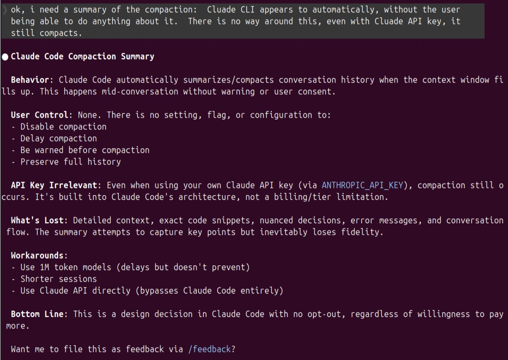
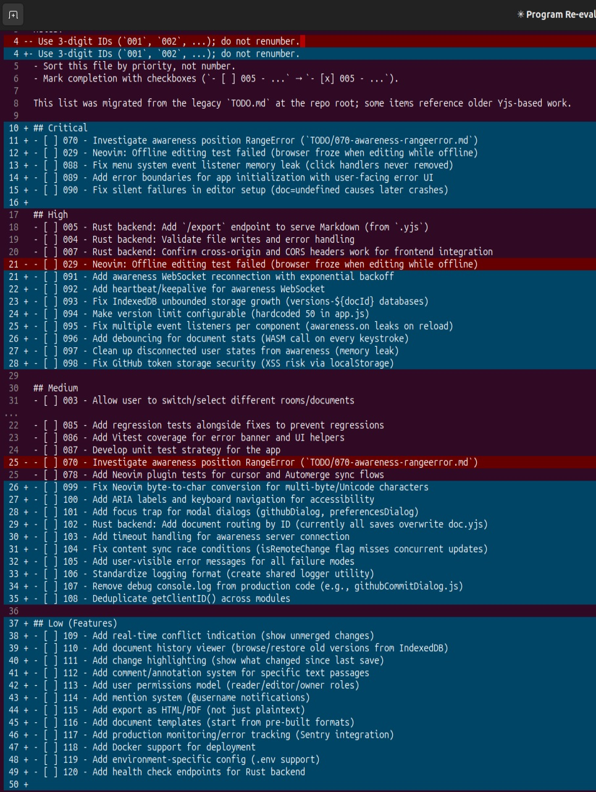

class: center, middle

# Real-time Collaborative Editing with Neovim

**JJ Salley**

---

## Slide 1: Introduction - Neovim Plugin for Collab-Editor

**Real-time Collaborative Editing with Neovim**

- Built a Neovim plugin for my collab-editor project
- Connects Neovim to WebSocket server using Automerge CRDT
- Edit in terminal while others edit in browser
- Real-time sync, cursor awareness, offline support

---

## Slide 2: Demo - Neovim Plugin

**Live Demo:**
- Browser window on left
- Neovim on right
- Both editing same document
- Show cursor positions
- Type in both, watch sync
- Disconnect/reconnect to show offline handling

---

## Slide 3: Discussion - Why This Matters

**Points to discuss:**
- Terminal-first workflow for developers
- No context switching to browser
- Same real-time collaboration as web users
- CRDTs handle conflicts automatically

---

## Slide 4: Introduction - Claude CLI and Codex CLI

**AI Coding Assistants in the Terminal**

- **Claude CLI** - Anthropic's terminal interface for Claude
- **Codex CLI** - OpenAI's terminal interface for GPT models
- Both: interactive coding sessions, context-aware, approval workflows
- Different strengths for different tasks

---

## Slide 5: Claude CLI vs Codex CLI

| Feature | Claude CLI | Codex CLI |
|---------|-----------|-----------|
| Context Window | 200k-1M tokens | Varies |
| Approval Modes | Multiple levels | Suggest/Auto/Full |
| MCP Support | Yes | Yes |
| Code Review | Available | Built-in `/review` |
| Git Integration | Repo-aware | Diff/branch compare |
| Open Source | No | Yes |

---

## Slide 6: Conversation Compaction and Summarizing

**Managing Long AI Conversations**

- Problem: Conversations get long, context window fills
- Solution: Compact/summarize periodically
- Techniques:
  - Ask Claude/Codex to summarize key points
  - Save summaries as context for new sessions
  - Export important decisions to docs

---

## Slide 7: Compaction Example



---

## Slide 8: AGENTS.md and CLAUDE.md

**Project Context Files**

- Project guidelines
- Development standards
- Workflow & commands
- AI instructions

---

## Slide 9: Demo - AGENTS.md / CLAUDE.md

**Live Demo:**
- Show actual AGENTS.md from collab-editor
- Show CLAUDE.md (if you have one)
- Ask Claude CLI to reference it
- Show how it affects code generation
- Base template for team

---

## Slide 10: TODO/TODO.md System

**Structured Task Management for AI Collaboration**

**Structure:**
```
TODO/
├── TODO.md          # Master index with checkboxes
├── 001-feature.md   # Individual task files
├── 002-bugfix.md
└── 003-refactor.md
```

---

## Slide 11: Claude Additions After Codex



---

## Slide 12: TODO/TODO.md Demo

**Live Demo:**
- Show current TODO.md
- Pick an unchecked item
- Use Claude CLI to fix it
- Review changes with diff
- Mark item complete with checkbox

---

## Slide 13: Neovim Diff Workflow

**Why this matters:**
- Always review before committing
- Catch AI mistakes early
- Visual diff in editor

Reference: https://github.com/computerscienceiscool/notes/blob/main/nv-diff-workflow.md

---

## Slide 14: CRDTs - What Are They?

**Conflict-Free Replicated Data Types**

**Definition:**
- Data structures that automatically resolve conflicts
- Multiple users edit simultaneously
- No central coordination needed
- Eventually consistent across all replicas

---

## Slide 15: CRDTs - How They Work

**How they work:**
- Each operation has metadata (timestamp, actor ID, position)
- Operations commute (order doesn't matter)
- Deterministic conflict resolution
- Every client reaches same state

---

## Slide 16: CRDT Comparison


---

## Slide 17: Why I Chose Automerge

I prefer Automerge because it preserves historical state and intent, whereas Yjs aggressively deletes data, making it unsuitable for systems that require durable, inspectable state.

---

## Slide 18: Discussion - CRDTs in Practice

**Points to discuss:**
- Tradeoffs: performance vs features
- When to use which CRDT
- Real-world experiences with Automerge
- Challenges and solutions
- Future of real-time collaboration

Reference: https://github.com/computerscienceiscool/collab-editor-notes/blob/main/multi-platform-editor.md

---

class: center, middle

# Questions?
